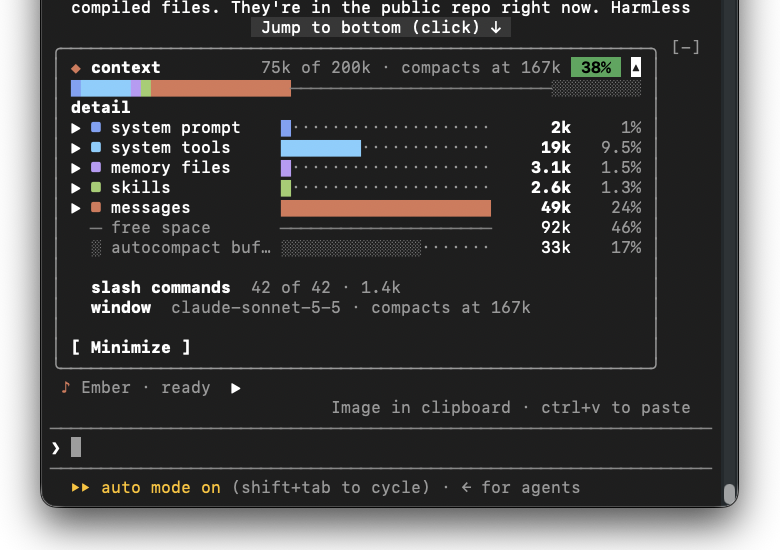
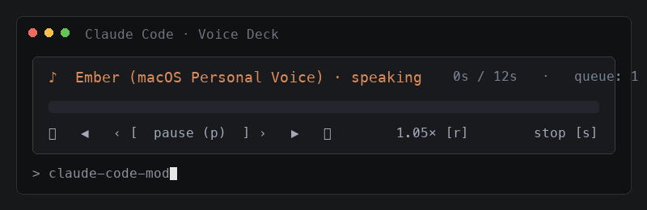

# See Stack Mods for Claude Code ⚡

[](https://code.claude.com)
[](LICENSE)
[](https://youtube.com/@SeeStack)
[](https://seestack.dev/mods)
[](https://seestack.lemonsqueezy.com/checkout/buy/88579484-e60b-4831-8aac-ac3af1c28010)

Curated developer mods for [Claude Code](https://code.claude.com) by [See Stack](https://youtube.com/@SeeStack).

Upgrade your terminal with live context window telemetry, compaction headroom alerts, and personal voice narration with media transport controls.

---

## ⚡ Quick Install (One Command)

Add the **See Stack Marketplace** to your Claude Code installation:

```bash
claude plugin marketplace add see-stack/claude-code-mods
```

Then install any of the mods:

```bash
# 1. Interactive Context Bar with Headroom Tracking
claude plugin install context-bar@seestack-mods

# 2. Text-to-Speech Voice Player with Transport Scrubber & Queue
claude plugin install read-aloud@seestack-mods
```

To update mods anytime:
```bash
claude plugin update context-bar@seestack-mods
claude plugin update read-aloud@seestack-mods
```

---

## 📋 Prerequisites & What You Need to Enable

Before installing, make sure your environment meets these requirements:

### 1. Claude Code Version (`v2.1.287` or higher)
Native plugin and mod support was introduced in Claude Code `v2.1.287`. Check your version:
```bash
claude --version
```
If you are on an older build, upgrade to the latest version:
```bash
npm install -g @anthropic-ai/claude-code
```

### 2. Verify Plugins Are Enabled
Once installed, verify that Claude Code recognizes the mods:
```bash
claude plugin list
```
If a mod shows as disabled, enable it with:
```bash
claude plugin enable context-bar@seestack-mods
claude plugin enable read-aloud@seestack-mods
```

### 3. Voice Synthesis (`read-aloud` mod only)
* **macOS**: Works out of the box with macOS speech synthesis (`say` / `AVSpeechSynthesizer`). 
* Supports personal voices (e.g. **Ember**, **Samantha**, **Daniel**). Configure your preferred voice in `System Settings > Accessibility > Spoken Content`.

---

## 🛠 Featured Mods

### 1. `context-bar`
A live stacked context window audit HUD placed directly above your prompt with an interactive collapsible accordion dropdown so you never burn 40,000 tokens on stale logs or get surprised by auto-compaction.



#### Key Features:
* **Interactive Accordion Dropdown**: Click anywhere on the header to reveal the full itemized audit (`detail`), or hit `[ Minimize ]` to collapse back to a single compact line.
* **Inline Drilldowns**: Click `▶` directly on `memory files` or `skills` to expand their itemized breakdown without repeating headers.
* **Auto-Compaction Headroom**: Real-time tracking of safety headroom before auto-compaction triggers (e.g. `compacts at 167k [38%]`).
* **Visual Token Meter**: Color-coded segments for system prompt, system tools, memory files, skills, messages, and free space.
* **Slash Command**: Type `/context-bar` inside any Claude Code session to toggle visibility.

```text
┌──────────────────────────────────────────────────────────────┐
│ ◆ context            75k of 200k · compacts at 167k  38% ▾   │
│ █■■■███████████████████████░░░░░░░░░░░░░░░░░░░░░░░░░░░░░░░░░ │
│ detail                                                       │
│ ▶ ■ system prompt    █·························   2k    1%   │
│ ▶ ■ system tools     ██████████················  19k  9.5%   │
│ ▶ ■ memory files     █························· 3.1k  1.5%   │
│ ▶ ■ skills           █························· 2.6k  1.3%   │
│ ▶ ■ messages         ██████████████████········  49k   24%   │
│   ─ free space       ──────────────────────────  92k   46%   │
│   ░ autocompact buf… ░░░░░░░░··················  33k   17%   │
│                                                              │
│ slash commands  42 of 42 · 1.4k                              │
│ window  claude-sonnet-5-5 · compacts at 167k                 │
│                                                              │
│ [ Minimize ]                                                 │
└──────────────────────────────────────────────────────────────┘
```

---

### 2. `read-aloud`
Brings a high-quality audio deck and Text-to-Speech into Claude Code with full media transport controls.



#### Key Features:
* **Media Deck**: Play/Pause, sentence scrubbing, reply queuing, and speed multiplier.
* **Terracotta Progress Bar**: Visual scrub bar matching your context meter.
* **Speech Queue**: Seamlessly queues replies without cutting off sentences mid-speech.
* **Clean Formatting**: Automatically strips markdown headers, raw code blocks, and table noise before speaking so the voice remains natural and conversational.
* **Slash Command**: Type `/read-aloud` or click the `read` button above your prompt.

#### Keyboard Transport Controls:
| Key | Action | Description |
|:---:|:---|:---|
| `p` | **Pause / Resume** | Instantly toggles speech playback |
| `s` | **Stop** | Halts audio and clears speech buffer |
| `◀` / `▶` | **Sentence Step** | Steps one sentence backward or forward |
| `⏮` / `⏭` | **Reply Step** | Jumps across queued assistant replies |
| `r` | **Speed Multiplier** | Cycles playback speed: `1×` ➔ `1.25×` ➔ `1.5×` ➔ `2×` |

---

## 🔧 Useful Commands Inside Claude Code

| Slash Command / Key | What it does |
|:---|:---|
| `/context-bar` | Toggles the Context Bar HUD above prompt |
| `/read-aloud` | Speaks the latest response out loud |
| `/plugins` | Opens the interactive Claude Code plugin manager |
| `/reload-plugins` | Hot-reloads all mods without restarting your terminal session |

---

## 💻 Local Development & Customization

To inspect, tweak, or test these mods locally:

```bash
git clone https://github.com/see-stack/claude-code-mods.git
cd claude-code-mods

# Load mods in development mode:
claude --plugin-dir ./mods/context-bar
claude --plugin-dir ./mods/read-aloud
```

Reload changes instantly in your active session with `/reload-plugins`.

---

## 🌐 Ecosystem & Community

* 📺 **YouTube**: [See Stack (@SeeStack)](https://youtube.com/@SeeStack) — In-depth AI agent architecture breakdowns and tutorials.
* 🌐 **Documentation & Vaults**: [seestack.dev](https://seestack.dev)
* 💬 Built for developers building real AI agent workflows.
* 📄 Licensed under the [MIT License](LICENSE).
